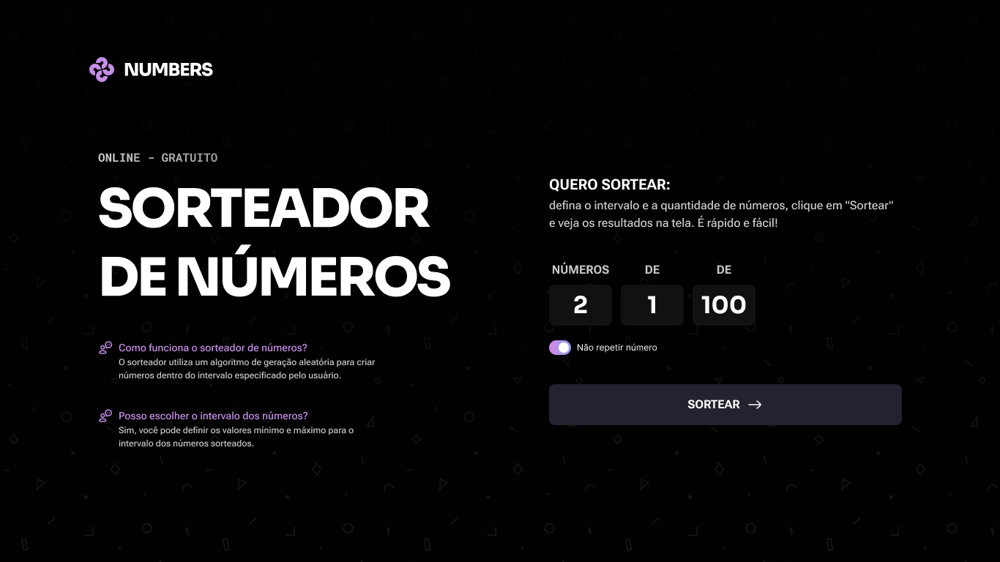

# Sorteador de Números

Aplicação web responsiva que gera números aleatórios a partir de um intervalo definido pelo usuário. O projeto combina HTML, CSS moderno (com variáveis, gradientes e animações) e JavaScript puro para oferecer uma experiência fluida tanto em desktop quanto em dispositivos móveis.

## Capturas de tela


.png)

## Funcionalidades

- Definição de quantidade, valor mínimo e máximo com validação em tempo real que só aceita inteiros positivos.
- Alternância `Não repetir número` para impedir números duplicados quando o intervalo comporta a quantidade solicitada.
- Exibição animada dos resultados: os números aparecem em sequência, com alerta ao final do sorteio e botão de ação bloqueado durante a animação.
- Feedback visual nos inputs e botão principal com gradientes, glow e estados `hover/focus`, mantendo o degradê ativo quando um campo está preenchido.
- Layout totalmente responsivo, com reorganização de blocos, tipografia fluida (`clamp`) e distribuição dos conteúdos por utilitários (`column-gap-36`, `none`, etc).

## Estrutura do projeto

```
.
├── index.html           # Estrutura base da página e formulário
├── js/
│   └── numbers.js       # Lógica do sorteio, validações e animações
├── styles/
│   ├── index.css        # Ponto de entrada que importa os demais módulos
│   ├── var.css          # Variáveis de cores e tipografia
│   ├── global.css       # Reset, body com gradiente e limites do container
│   ├── main.css         # Layout principal e regras responsivas
│   ├── form.css         # Estilos do formulário, toggle customizado e resultado
│   ├── input.css        # Tratamento dos campos numéricos e efeitos visuais
│   ├── button.css       # Botão principal com borda animada
│   ├── questions.css    # FAQ lateral e versão mobile
│   └── utility-classes.css # Classes utilitárias como espaçamentos e helpers
└── assets/              # Ícones, logo e background
```

## Como funciona a lógica (`js/numbers.js`)

- Seleciona e controla o estado dos painéis de formulário e resultado para alternar entre configuração e exibição.
- Garante entradas numéricas através de listeners que bloqueiam teclas inválidas, sanitizam `paste` e removem qualquer caractere não numérico.
- Validações antes do sorteio: preenchimento obrigatório, quantidade maior que zero, consistência do intervalo (`min < max`) e limite da opção sem repetição.
- Dois algoritmos de sorteio:
  - `drawNumbersWithoutRepetition`: cria um array com todo o intervalo (`buildRange`) e embaralha (`shuffle`) para fatiar os números únicos.
  - `drawNumbersWithRepetition`: usa `randomInRange` para sortear a quantidade solicitada permitindo repetições.
- `renderResults` controla a animação: oculta o botão, injeta spans individualmente no container e usa `requestAnimationFrame` + `animationend` para encadear a aparição de cada número.

## Como executar

1. Faça o download ou clone este repositório.
2. Abra o arquivo `index.html` diretamente no navegador (não é necessário servidor).
3. Informe quantos números deseja sortear, defina o intervalo e clique em `Sortear`.
4. Ative a opção `Não repetir número` se quiser resultados únicos dentro do intervalo disponível.

## Tecnologias e técnicas utilizadas

- HTML semântico com formulário acessível, labels associados e inputs configurados com `inputmode` e `pattern`.
- CSS modularizado por responsabilidade, uso intenso de variáveis (`var.css`), `clamp` para medidas fluidas, gradientes, animações (`@keyframes`) e pseudo-elementos para efeitos de glow.
- JavaScript moderno (ES6+), manipulação direta do DOM, `requestAnimationFrame` para animações suaves e abordagem funcional para geração de números.

## Possíveis evoluções

- Exibir histórico dos sorteios e permitir exportar os resultados.
- Adicionar validação visual inline (mensagens junto aos campos) em vez de `alert`.
- Criar teste unitário simples para as funções de sorteio.
- Disponibilizar deploy estático (GitHub Pages, Vercel, etc.) para compartilhar o projeto facilmente.

---

Projeto desenvolvido como parte do módulo *Nível 5* do curso Full-Stack.
